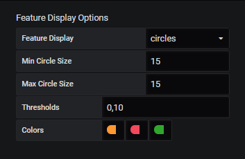
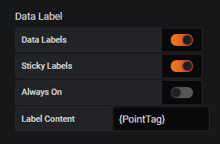



# Settings
The Settings in this Panel are divided into 5 seperate groups. This Page describes each group and the settings in that group. Note that parts of this panel are still under development and not all Settings are Avialable,.

### Map options
The following Settings are concerned with the Maps general behaviour and apperance
* **Map Background**: This determines the Background map. Multiple options are available including some CartoDB, ESRI and Stamen options.
* **Center**: this options determines the center of the map when the panel is opened. options include `(0,0)`, `North America`, `Europe`, `W Asia`, `SE Asia` and `custom`. if `custom` is selected the longitude and lattitude can be entered manually.
* **Initial Zoom**: This option determines the zoom level when the Map is opened. Note that a zoom of `1` corresponds to the farthest out and a zoom of `16` is the maximum. Some background maps do not allow the full range and restrict the zoom level to a smaller range.
* **Zoom Step Size**: This option determines the change in zoom level when the `+` and `-` buttons on the map are used.
* **Mouse Wheel Zoom**: This option enables the userr to zoom using their mouse wheel. The change in zoom level is also determined by the **Zoom Step Size** option

### Data Location Options

* **Location Data**: This determines where the location information for the datapoints comes from. `OpenHistorian` will attempt to get the information directkly from the OpenPDC or OpenHistorian that provides the Data. `jspon Endpoint` will get the data from a .json file. 
* **Endpoint url**: This option is only available if **Location Data** is set to `json Endpoint`. It determines the URL for the .json file to get the data. The file should have a format similar to this file.
* **Aggregation**: This option determines how the datapoitns are processed vefore they are shown on the map. Options include `current` (the most current value), `avg` (The average of the selected timeperiod), `min`, `max` and `total`
* **Radial Distribution for Overlapping Coordinates**: This option is only available if **Location Data** is set to `OpenHistorian`. If enabled any datapoints that are located on top of each other are spread out in a cocentric circle around their actual location.
* **Distribution radius**: This option is only available if **Radial Distribution for Overlapping Coordinates** is enabled. This option determines the radius of the cocentric circle.
* **Hide only nulls**: If enabled data with only `null` values in it will not be shown on the map.
* **Hide only zeros**: If enabled data with only `0` values in it will not be shown on the map.
* **Data Filter**: This option can filter the data actually shown on the map. This is usefull if some data should be shown on a text layer. It is a Regex string that gets matched to the PointTag of the data. If it is left blang no filter is applied and all data (except adata that is `null` or `0`) is shown on the map.

### Feature Display Options
The following options are concerned with how the data is displayed on the Map:
* **Feature Display**: This option spedifies if the data is shown as circles or as 4-bit bar.
* **Min Circle Size**: If `Feature Display` is set to `circles` this option is used to determine the minimum size of these circles.
* **Max Circle Size**: If `Feature Display` is set to `circles` this option is used to determine the maximum size of these circles. The actual size of each circle is determined by the value of the associated datapoint.
* **Thresholds**: This option determines the thershhold at which the circles will change color.
* **Colors**: This option specifies the color of the circles based on the value of the associated point and the thresholds defined in the `Thresholds` option.

### Data Label
These options determines if and how data labels are displayed:
* **Data Labels**: If this option is disabled no data labels are shown.
* **Sticky Labels**: If this option is enabled the labels will stick event if the user moves the mopusepointer away from the datapoint.
* **Always On**: If the `Sticky Labels` otpion is enabled this option allows multiple labels to be visible at the same time. If this option is disabled only one label can be visible at a time, and opening another label will close the previous label.
* **Label Content**: This option allows the user to specify the text visible in the data labels. The field takes html and can also contain the following keywords: `{value}`, `{deviceID}`, `{PointTag}`, `{deviceName}`.

### Additional Layers
This Section contains all options related to additional Map Layers. To add a Layer the `Add Layer` Button is clicked. this will add a new empty Layer. Each Layer has the following settings:
* ** Label**: This option is the name of the Layer.
* **Source**: This is a URL endpoint representing the source of the Data.
* **Optional**: If this option is enabled the user has the option to turn this Layer off or on.
* **Dynamic Data**: This option should be enabled if the data associated with this layer needs to be updated frequently.
* **Z index**: This option is a number specifying in what order the layers should be displayed. The Map will always be the lowest layer and the data Features (circles, data labels etc..) will always be on top of everything else.
* **Min Zoom**: This option specifies the minimum zoom neccsarry for the layer to appear.
* **Max Zoom**: This option specifies a maximum zoom. If the map is zoomed in further the layer disappears.

In addition the following settings are available for soecific layer types:

#### GeoJSON
There are no additional settings for a GeoJSON Layer. Note that for GeoJSON Layer the `Source` setting should point to a valid `.geojson` file.
#### Tile
* **Opacity**: This specifies the oapcity of the layer. If the setting is `1` the layer is fully opaque and at `0` the layer is fully transparent.

Note that for Tile layers the `Source` setting should point to a valid tile server.
#### WMS
* **Opacity**: This specifies the oapcity of the layer. If the setting is `1` the layer is fully opaque and at `0` the layer is fully transparent.
* **Layer**: This specifies the layer according to the wms capability file.

Note that for s WMS layer the `Source` setting should point to a valid WMS server.
#### Text
For a text layer the source setting should point to a valid `.json` File that contains an array of Text elements. These Text Elements have the following fields:
[
* `Text`: This Field contains the text that should be displayed. The field supports HTML and if pointTags are included in brackets (e.g. `[Tag1:VH]) they are replaced with the value of the tag before the text is palced on the map.
* `Latitude`: This field contains the Latitude where the Text should be placed.
* `Longitude`: This field contains the Longitude where the Text should be placed.

An example file for placing Text on the Map Can be found [here](./TextExample.json)
