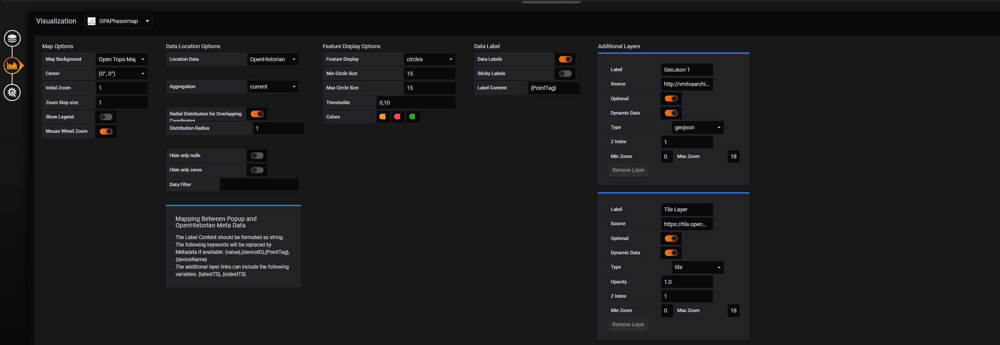
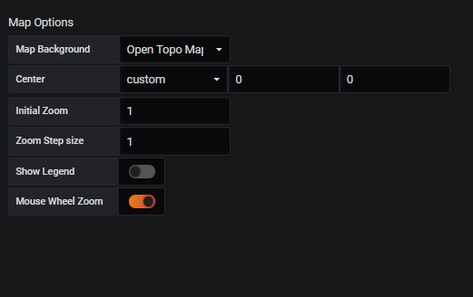
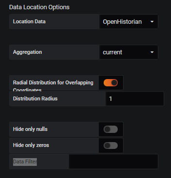



# Settings
The Settings in this Panel are divided into 5 seperate groups. This Page describes each group and the settings in that group. Note that parts of this panel are still under development and not all Settings are Avialable,.

### Map options
The following Settings are concerned with the Maps general behaviour and apperance
* **Map Background**: This determines the Background map. Multiple options are available including some CartoDB, ESRI and Stamen options.
* **Center**: this options determines the center of the map when the panel is opened. options include `(0,0)`, `North America`, `Europe`, `W Asia`, `SE Asia` and `custom`. if `custom` is selected the longitude and lattitude can be entered manually.
* **Initial Zoom**: This option determines the zoom level when the Map is opened. Note that a zoom of `1` corresponds to the farthest out and a zoom of `16` is the maximum. Some background maps do not allow the full range and restrict the zoom level to a smaller range.
* **Zoom Step Size**: This option determines the change in zoom level when the `+` and `-` buttons on the map are used.
* **Mouse Wheel Zoom**: This option enables the userr to zoom using their mouse wheel. The change in zoom level is also determined by the **Zoom Step Size** option
* **Show Legend**: This setting currently does not work.

### Data Location Options

* **Location Data**: This determines where the location information for the datapoints comes from. `OpenHistorian` will attempt to get the information directkly from the OpenPDC or OpenHistorian that provides the Data. `jspon Endpoint` will get the data from a .json file. 
* **Endpoint url**: This option is only available if **Location Data** is set to `json Endpoint`. It determines the URL for the .json file to get the data. The file should have a format similar to this file.
* **Aggregation**: This option determines how the datapoitns are processed vefore they are shown on the map. Options include `current` (the most current value), `avg` (The average of the selected timeperiod), `min`, `max` and `total`
* **Radial Distribution for Overlapping Coordinates**: This option is only available if **Location Data** is set to `OpenHistorian`. If enabled any datapoints that are located on top of each other are spread out in a cocentric circle around their actual location.
* **Distribution radius**: This option is only available if **Radial Distribution for Overlapping Coordinates** is enabled. This option determines the radius of the cocentric circle.
* **Hide only nulls**: If enabled data with only `null` values in it will not be shown on the map.
* **Hide only zeros**: If enabled data with only `0` values in it will not be shown on the map.
* **Data Filter**: This option can filter the data actually shown on the map. This is usefull if some data should be shown on a text layer (link missing). It is a Regex string that gets matched to the PointTag of the data. If it is left blang no filter is applied and all data (except adata that is `null` or `0`) is shown on the map.

### Feature Display Options

### Data Label

### Additional Layers

### Multiple Maps
These settings are currently not available.